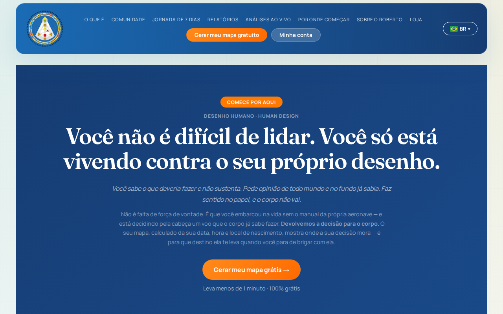
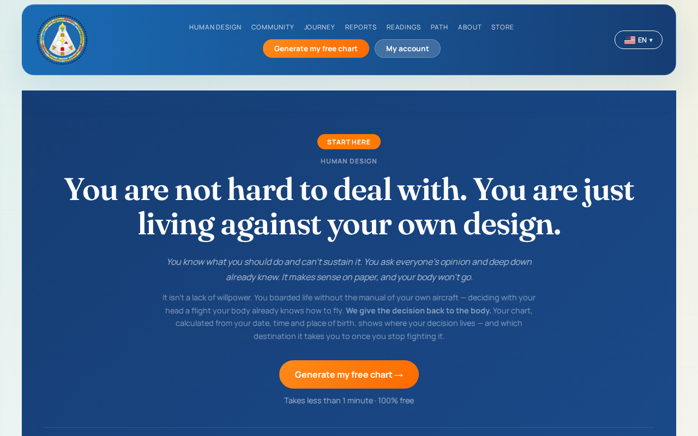
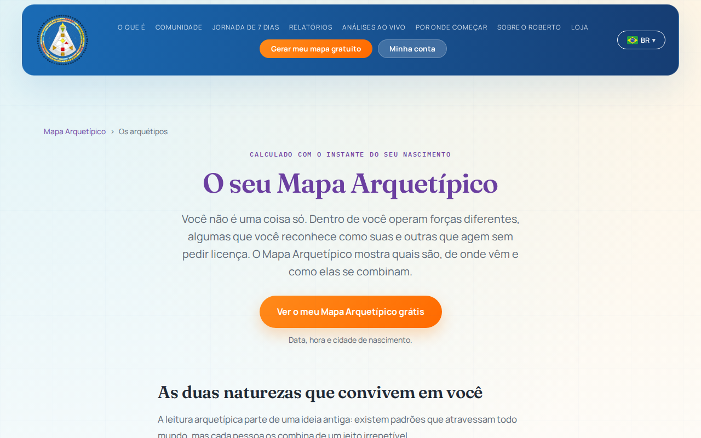

  
  
  
  

<h1 align="center">Roberto de Farias</h1>

<strong>Construí sozinho, em 6 meses, o sistema que opera o meu negócio.</strong> 
Ruby on Rails · 4 idiomas · 11 domínios · 3 moedas · 4.549 testes automatizados

Marca, Produto Digital e IA · Terapeuta há 26 anos · PT · EN · FR · ES 
Florianópolis, Brasil · cidadania brasileira e canadense

Aberto a oportunidades em <strong>Brasil · Canadá · Europa · Remoto</strong> — freelance ou contratação

<a href="#in-english">🇬🇧 In English</a>

---

## O projeto: Desenho Humano

Em dezembro de 2025 eu pedi orçamento a várias agências para construírem o meu sistema. Desisti de todas pelo mesmo motivo, e não era o preço: o conhecimento era meu, e eu teria que ensiná-lo em tempo integral ou entregá-lo. Em março de 2026 me matriculei na Le Wagon e resolvi fazer eu mesmo.

Cem dias depois da primeira linha de código veio a primeira venda.

O código é privado. Ele opera uma empresa real, com clientes reais, pagamentos reais e dados de pessoas. Esta página mostra o que ele faz, como foi construído e em que tamanho está. O gráfico de contribuições abaixo, no meu perfil, registra o trabalho dia a dia desde março de 2026.

  

### O que está no ar

Um ecossistema de **quatro marcas num código só**, em Ruby on Rails sobre PostgreSQL:

| Marca | O que é | Endereço |
|---|---|---|
| **Desenho Humano** | Mapa de Human Design gratuito, relatórios gerados por IA, análises ao vivo, curso, loja e comunidade | [desenhohumano.com.br](https://desenhohumano.com.br) · [humandesign.com.br](https://humandesign.com.br) · [mapahumano.com.br](https://mapahumano.com.br) |
| **Human Design** (EN · ES · FR · PT) | O mesmo produto em quatro idiomas, com preço na moeda do mercado | [yourhumandesignmap.com](https://yourhumandesignmap.com) · [disenohumano.org](https://disenohumano.org) · [designhumaingratuit.com](https://designhumaingratuit.com) |
| **Mapa Arquetípico** | Mapa de arquétipos junguianos calculado a partir do nascimento | [mapaarquetipico.com.br](https://mapaarquetipico.com.br) · [arquetipos.com.br](https://arquetipos.com.br) |
| **Logotipo com Arquétipos** | A agência de marca: identidade visual a partir de arquétipos, com CRM e manual de marca online | [logotipocomarquetipos.com.br](https://logotipocomarquetipos.com.br) |

### O que o sistema faz

- **Calcula o mapa** de qualquer pessoa a partir de data, hora e local de nascimento, com efeméride astronômica licenciada (Swiss Ephemeris) sobre uma base de **234 mil cidades** com fuso horário histórico.
- **Vende e entrega sozinho**: mapa gratuito, mais de vinte relatórios digitais, análises ao vivo com agendamento, curso, assinatura e loja com produtos físicos. Do clique ao relatório na conta do cliente, sem intervenção humana.
- **Gera relatórios personalizados por IA**, com fila de processamento, PDF, armazenamento em nuvem e rede de segurança para nenhum pedido pago ficar sem entrega.
- **Cobra em três moedas** (real, dólar, euro) por **Mercado Pago e Stripe**, à vista e recorrente, com webhooks, reconciliação e resgate de carrinho abandonado.
- **Fala quatro idiomas**: português, inglês, espanhol e francês, em onze domínios, com conteúdo, e-mails e preços por mercado.
- **Opera o negócio** num painel administrativo com financeiro, CRM, atendimento, marketing e integração com Google Ads e GA4.
- **Agente vendedor de IA** no site, que orienta o visitante até o produto certo.

  
  

### Em números

| | |
|---|---|
| Primeiro commit | 25 de março de 2026 |
| Commits no `main` | 5.544 |
| Pull Requests mergeados | 556 |
| Testes automatizados | 4.549, em 629 arquivos, suíte sempre verde |
| Linhas de aplicação (Ruby, views, JS, CSS) | cerca de 296 mil |
| Linhas de teste | cerca de 108 mil |
| Models · Services · Controllers · Mailers · Jobs | 83 · 302 · 143 · 34 · 42 |
| Idiomas · domínios · moedas | 4 · 11 · 3 |
| Mapas gerados em produção | mais de 4 mil |

Construído sozinho, em seis meses, com inteligência artificial como par de programação. Uma estimativa do custo de construir o mesmo sistema com uma equipe, em catorze frentes e com prazos e taxas de mercado, fica entre R$ 810 mil e R$ 1,16 milhão.

### Como foi construído

- **Stack:** Ruby on Rails 8, PostgreSQL, Hotwire (Turbo + Stimulus), Solid Queue, Solid Cache, Propshaft.
- **Infra:** Heroku com deploy automático a cada merge, Cloudflare, Cloudflare R2 para os PDFs, Resend para e-mail transacional, CI com análise de segurança (Brakeman) a cada Pull Request.
- **Método:** cada frente em branch própria, Pull Request e merge no `main`; TDD com baseline zero de falhas; service objects por domínio; zonas sensíveis (pagamento, migrações, rotas) protegidas por regras de revisão.
- **IA como método, não como assistente:** agentes de código trabalhando em paralelo, cada um numa frente isolada, com regras escritas de permissão, revisão e entrega. O irreversível (deploy, dinheiro, e-mail ao cliente) passa sempre pela minha mão.

---

## De onde isso vem

Sou terapeuta há 26 anos, analista e professor formado pela International Human Design School, nos Estados Unidos. Em paralelo, dirijo uma agência de marca cujo carro-chefe é a criação de identidade visual a partir de arquétipos junguianos, com clientes em 27 países e cinco continentes. Já formei mais de 40 mil alunos.

Não concluí graduação e nunca tinha trabalhado como programador nem colocado software em produção. Fiz a imersão da **Le Wagon** em março de 2026. As duas ideias de projeto que propus foram as escolhidas e desenvolvidas pela turma, e depois fui convidado a voltar à escola como palestrante na Alumni Night.

### O que eu faço

- Estratégia de marca e sistemas de comunicação
- Produto digital de ponta a ponta, da ideia ao checkout funcionando
- Construção de software com IA, não como assistente, mas como método
- Comunicação em quatro idiomas, em mercados diferentes

Português nativo · Inglês e francês fluentes · Espanhol avançado

---

## In English

**I built my company's platform solo in 6 months.** Ruby on Rails · 4 languages · 11 domains · 3 currencies · 4,549 automated tests.

In December 2025 I asked several agencies to quote building my system. I turned them all down for the same reason, and it wasn't the price: the domain knowledge was mine, and I would have had to either teach it full-time or hand it over. In March 2026 I enrolled at Le Wagon and decided to build it myself. One hundred days after the first line of code came the first sale.

The code is private: it runs a real business, with real customers, payments and personal data. This page shows what it does and how big it is. The contribution graph on my profile records the work day by day since March 2026.

**What is live:** an ecosystem of four brands on a single codebase, in Ruby on Rails over PostgreSQL. A free Human Design chart calculated with a licensed ephemeris over 234,000 cities; AI-generated personalised reports with queueing, PDF output and a safety net; live readings with scheduling; a course, a subscription and a store; Mercado Pago and Stripe, one-off and recurring, with webhooks and reconciliation; four languages, eleven domains and three currencies; an admin panel covering finance, CRM, support and marketing, integrated with Google Ads and GA4; an AI sales agent on the site.

**By the numbers:** first commit on 25 March 2026 · 5,544 commits · 556 merged pull requests · 4,549 automated tests · about 296,000 lines of application code and 108,000 lines of tests · 83 models, 302 services, 143 controllers · over 4,000 charts generated in production.

Built solo, in six months, with AI as a pair programmer. An estimate of what the same system would cost to build with a team, across fourteen workstreams at market rates, lands between R$ 810,000 and R$ 1.16 million (roughly CAD 600,000 to 1.17 million).

**Where this comes from:** I have worked as a therapist for 26 years and am a certified analyst and teacher from the International Human Design School. Alongside that, I run a brand agency whose core offer is visual identity built from Jungian archetypes, with clients in 27 countries across five continents. I have taught over 40,000 students. I never finished a university degree, and I had never worked as a developer or shipped software to production before this.

Portuguese native · English and French fluent · Spanish advanced · Brazilian and Canadian citizen · Florianópolis, Brazil

**Open to opportunities in Brazil · Canada · Europe · Remote**, freelance or full-time.

<em>Os números desta página são de 3 de outubro de 2026.</em>

